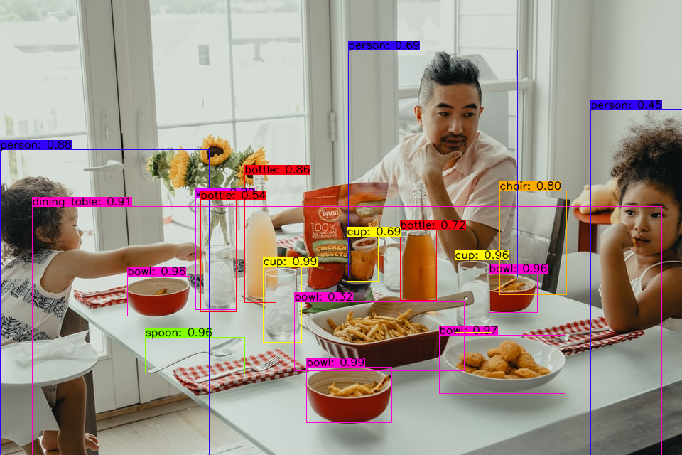
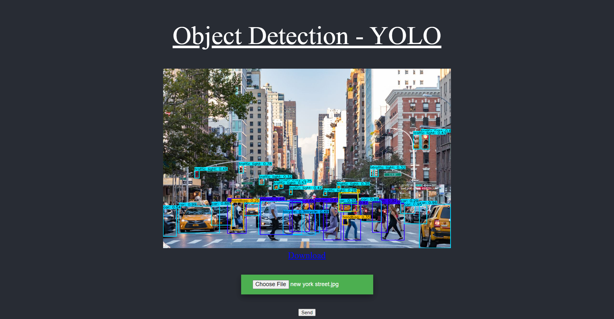

# YOLOv4 Object Detection API Server

This repository is mixture version of https://github.com/theAIGuysCode/Object-Detection-API (YOLOv3 REST API) and
https://github.com/theAIGuysCode/tensorflow-yolov4-tflite (YOLOv4).
so that I added REST API functions on YOLOv4.

YOLOv4, YOLOv4-tiny Implemented in Tensorflow 2.0. Convert YOLO v4, YOLOv3, YOLO tiny .weights to .pb, .tflite and trt format for tensorflow, tensorflow lite, tensorRT, Flask, REST API.

## 1. Install
### Conda (Recommended)

```shell
# Tensorflow CPU
conda env create -f conda-cpu.yml
conda activate yolov4-cpu

# Tensorflow GPU
conda env create -f conda-gpu.yml
conda activate yolov4-gpu

# For apple silicon mac
conda env create -f conda-gpu-apple-silicon-mac.yml
conda activate yolov4-gpu
```

### Pip
```shell
# TensorFlow CPU
pip install -r requirements.txt

# TensorFlow GPU
pip install -r requirements-gpu.txt
```

## Downloading Official Pre-trained Weights
YOLOv4 comes pre-trained and able to detect 80 classes. For easy demo purposes we will use the pre-trained weights.
Download pre-trained yolov4.weights file: https://drive.google.com/open?id=1cewMfusmPjYWbrnuJRuKhPMwRe_b9PaT

Copy and paste yolov4.weights from your downloads folder into the 'data' folder of this repository.

If you want to use yolov4-tiny.weights, a smaller model that is faster at running detections but less accurate, download file here: https://github.com/AlexeyAB/darknet/releases/download/darknet_yolo_v4_pre/yolov4-tiny.weights

## Using Custom Trained YOLOv4 Weights
<strong>Learn How To Train Custom YOLOv4 Weights here: https://www.youtube.com/watch?v=mmj3nxGT2YQ </strong>

Copy and paste your custom .weights file into the 'data' folder and copy and paste your custom .names into the 'data/classes/' folder.

The only change within the code you need to make in order for your custom model to work is on line 14 of 'core/config.py' file.
Update the code to point at your custom .names file as seen below. (my custom .names file is called custom.names but yours might be named differently)


<strong>Note:</strong> If you are using the pre-trained yolov4 then make sure that line 14 remains <strong>coco.names</strong>.

## Convert
To implement YOLOv4 using TensorFlow, first we convert the .weights into the corresponding TensorFlow model files and then run the model.
```shell
# Convert darknet weights to tensorflow
## yolov4
python save_model.py --weights ./data/yolov4.weights --output ./checkpoints/yolov4-416 --input_size 416 --model yolov4 

# yolov4-tiny
python save_model.py --weights ./data/yolov4-tiny.weights --output ./checkpoints/yolov4-tiny-416 --input_size 416 --model yolov4 --tiny

# custom yolov4
python save_model.py --weights ./data/custom.weights --output ./checkpoints/custom-416 --input_size 416 --model yolov4 
```

## Run
### Run Flask app
```shell
python app.py
```

### Run Waitress wsgi for production deployment
```shell
python waitress-server.py
```

<br><br>

## 2. Usage

### Detections by image files (POST http://localhost:5050/detections/by-image-files)
need more than 0 image files, multipart/form-data, key name is "images"

#### Request example(python.requests)
```python
import requests

url = "http://127.0.0.1:5050/detections/by-image-files"

payload={}
files=[
  ('images',('dog.jpg',open('/C:/Users/Qone/repos/YOLOv4-Object-Detection-API-Server/data/images/dog.jpg','rb'),'image/jpeg')),
  ('images',('kite.jpg',open('/C:/Users/Qone/repos/YOLOv4-Object-Detection-API-Server/data/images/kite.jpg','rb'),'image/jpeg'))
]
headers = {}

response = requests.request("POST", url, headers=headers, data=payload, files=files)

print(response.text)
```

#### Response example
```shell
{
    "response": [
        {
            "image": "dog.jpg",
            "detections": [
                {
                    "class": "bicycle",
                    "confidence": 98.68,
                    "box": [
                        0.22659872472286224,
                        0.16641898453235626,
                        0.7383183240890503,
                        0.7395057082176208
                    ]
                },
                {
                    "class": "dog",
                    "confidence": 98.52,
                    "box": [
                        0.4033146798610687,
                        0.1720491647720337,
                        0.9337449669837952,
                        0.406764417886734
                    ]
                },
                {
                    "class": "truck",
                    "confidence": 92.15,
                    "box": [
                        0.1300187110900879,
                        0.6068406701087952,
                        0.2994907796382904,
                        0.9028187990188599
                    ]
                }
            ]
        },
        {
            "image": "kite.jpg",
            "detections": [
                {
                    "class": "person",
                    "confidence": 99.11,
                    "box": [
                        0.7725002765655518,
                        0.15819524228572845,
                        0.955871045589447,
                        0.20016619563102722
                    ]
                },
                {
                    "class": "kite",
                    "confidence": 98.88,
                    "box": [
                        0.08883842825889587,
                        0.4350317120552063,
                        0.17153428494930267,
                        0.4975464642047882
                    ]
                },
                {
                    "class": "person",
                    "confidence": 98.6,
                    "box": [
                        0.6820783615112305,
                        0.08408961445093155,
                        0.84914231300354,
                        0.1225830614566803
                    ]
                },
                {
                    "class": "kite",
                    "confidence": 87.96,
                    "box": [
                        0.38221558928489685,
                        0.42745858430862427,
                        0.40842822194099426,
                        0.4442833960056305
                    ]
                },
                {
                    "class": "person",
                    "confidence": 85.87,
                    "box": [
                        0.5421252250671387,
                        0.2548080086708069,
                        0.560500979423523,
                        0.26386842131614685
                    ]
                },
                {
                    "class": "kite",
                    "confidence": 84.4,
                    "box": [
                        0.2625654339790344,
                        0.20689727365970612,
                        0.3109365999698639,
                        0.22676025331020355
                    ]
                },
                {
                    "class": "person",
                    "confidence": 78.57,
                    "box": [
                        0.5600144267082214,
                        0.38356536626815796,
                        0.585326611995697,
                        0.39563310146331787
                    ]
                },
                {
                    "class": "person",
                    "confidence": 78.54,
                    "box": [
                        0.5680103302001953,
                        0.02381865493953228,
                        0.6170229911804199,
                        0.042786046862602234
                    ]
                },
                {
                    "class": "person",
                    "confidence": 76.38,
                    "box": [
                        0.5647990107536316,
                        0.059801846742630005,
                        0.6308582425117493,
                        0.07934856414794922
                    ]
                },
                {
                    "class": "kite",
                    "confidence": 73.57,
                    "box": [
                        0.37724360823631287,
                        0.3463357090950012,
                        0.3972048759460449,
                        0.3593466877937317
                    ]
                },
                {
                    "class": "person",
                    "confidence": 68.83,
                    "box": [
                        0.5980629920959473,
                        0.13111814856529236,
                        0.6402380466461182,
                        0.14322905242443085
                    ]
                },
                {
                    "class": "kite",
                    "confidence": 68.4,
                    "box": [
                        0.43732577562332153,
                        0.8011485934257507,
                        0.47132566571235657,
                        0.8150034546852112
                    ]
                },
                {
                    "class": "kite",
                    "confidence": 55.76,
                    "box": [
                        0.41698184609413147,
                        0.22577570378780365,
                        0.4412486255168915,
                        0.24203325808048248
                    ]
                },
                {
                    "class": "person",
                    "confidence": 46.35,
                    "box": [
                        0.5745782852172852,
                        0.3943392336368561,
                        0.5909861326217651,
                        0.4089730978012085
                    ]
                },
                {
                    "class": "person",
                    "confidence": 41.32,
                    "box": [
                        0.5020405650138855,
                        0.891931414604187,
                        0.5144351124763489,
                        0.899072527885437
                    ]
                },
                {
                    "class": "kite",
                    "confidence": 40.03,
                    "box": [
                        0.4195924699306488,
                        0.5634137988090515,
                        0.4349488317966461,
                        0.5703240036964417
                    ]
                },
                {
                    "class": "person",
                    "confidence": 36.76,
                    "box": [
                        0.5806989669799805,
                        0.019801238551735878,
                        0.6189168095588684,
                        0.037031080573797226
                    ]
                }
            ]
        }
    ]
}
```

<br><br>

### Image by image file(POST http://localhost:5050/image/by-image-file)
need 1 image file, multipart/form-data, key name is "images"

#### Request example(nodejs.axios)
```javascript
var axios = require('axios');
var FormData = require('form-data');
var fs = require('fs');
var data = new FormData();
data.append('images', fs.createReadStream('/C:/Users/Qone/repos/YOLOv4-Object-Detection-Server/data/images/dog.jpg'));

var config = {
  method: 'post',
  url: 'http://127.0.0.1:5050/image/by-image-file',
  headers: { 
    ...data.getHeaders()
  },
  data : data
};

axios(config)
.then(function (response) {
  console.log(JSON.stringify(response.data));
})
.catch(function (error) {
  console.log(error);
});

```

#### Response example

<br><br><br>
### Detections by image url list(POST http://localhost:5050/detetions/by-url-list)
need image url list json form
#### Request example
```json
{
    "images" : [
            "https://images.unsplash.com/photo-1627662055794-94ab33f5913a",
            "https://images.unsplash.com/photo-1622495506073-56b1152a010c"
        ]
}
```

#### Response example
```shell
{
    "response": [
        {
            "image": "Image1",
            "detections": [
                {
                    "class": "bowl",
                    "confidence": 98.49,
                    "box": [
                        0.8068702220916748,
                        0.4503408670425415,
                        0.9296261072158813,
                        0.5750141143798828
                    ]
                },
                {
                    "class": "cup",
                    "confidence": 97.94,
                    "box": [
                        0.5713980197906494,
                        0.6671542525291443,
                        0.7300602197647095,
                        0.7218816876411438
                    ]
                },
                {
                    "class": "cup",
                    "confidence": 97.69,
                    "box": [
                        0.5849601030349731,
                        0.3867762088775635,
                        0.7522372007369995,
                        0.44097432494163513
                    ]
                },
                {
                    "class": "bowl",
                    "confidence": 96.1,
                    "box": [
                        0.6081124544143677,
                        0.18675625324249268,
                        0.6940791606903076,
                        0.27908602356910706
                    ]
                },
                {
                    "class": "bowl",
                    "confidence": 92.54,
                    "box": [
                        0.60157710313797,
                        0.7178356647491455,
                        0.686405599117279,
                        0.7896746397018433
                    ]
                },
                {
                    "class": "bowl",
                    "confidence": 90.81,
                    "box": [
                        0.7388676404953003,
                        0.6445244550704956,
                        0.8642051219940186,
                        0.8280567526817322
                    ]
                },
                {
                    "class": "vase",
                    "confidence": 88.13,
                    "box": [
                        0.4349602460861206,
                        0.28476348519325256,
                        0.6799468398094177,
                        0.3464072346687317
                    ]
                },
                {
                    "class": "bottle",
                    "confidence": 87.08,
                    "box": [
                        0.43529483675956726,
                        0.3596290946006775,
                        0.6646489500999451,
                        0.4041157364845276
                    ]
                },
                {
                    "class": "person",
                    "confidence": 86.4,
                    "box": [
                        0.33264943957328796,
                        0.0,
                        1.0,
                        0.3069411516189575
                    ]
                },
                {
                    "class": "dining table",
                    "confidence": 84.89,
                    "box": [
                        0.4721536934375763,
                        0.06169414892792702,
                        1.0,
                        0.9701008200645447
                    ]
                },
                {
                    "class": "person",
                    "confidence": 81.4,
                    "box": [
                        0.1144622340798378,
                        0.37960779666900635,
                        0.605109691619873,
                        0.7577102780342102
                    ]
                },
                {
                    "class": "fork",
                    "confidence": 73.61,
                    "box": [
                        0.741657018661499,
                        0.2172098457813263,
                        0.8201388120651245,
                        0.35427671670913696
                    ]
                },
                {
                    "class": "bottle",
                    "confidence": 70.68,
                    "box": [
                        0.5082425475120544,
                        0.5854617953300476,
                        0.6571321487426758,
                        0.6402410864830017
                    ]
                },
                {
                    "class": "chair",
                    "confidence": 66.25,
                    "box": [
                        0.4206991493701935,
                        0.7234641313552856,
                        0.6418891549110413,
                        0.8394129872322083
                    ]
                },
                {
                    "class": "bottle",
                    "confidence": 64.52,
                    "box": [
                        0.44433778524398804,
                        0.29224613308906555,
                        0.6785905361175537,
                        0.34613561630249023
                    ]
                },
                {
                    "class": "spoon",
                    "confidence": 52.35,
                    "box": [
                        0.741657018661499,
                        0.2172098457813263,
                        0.8201388120651245,
                        0.35427671670913696
                    ]
                },
                {
                    "class": "person",
                    "confidence": 35.29,
                    "box": [
                        0.24801567196846008,
                        0.8235538601875305,
                        0.9413383603096008,
                        1.0
                    ]
                },
                {
                    "class": "bottle",
                    "confidence": 30.45,
                    "box": [
                        0.40443146228790283,
                        0.44823896884918213,
                        0.6492757797241211,
                        0.5132496356964111
                    ]
                },
                {
                    "class": "bowl",
                    "confidence": 28.11,
                    "box": [
                        0.668978214263916,
                        0.42829829454421997,
                        0.8111904263496399,
                        0.6795439720153809
                    ]
                }
            ]
        },
        {
            "image": "Image2",
            "detections": [
                {
                    "class": "car",
                    "confidence": 99.69,
                    "box": [
                        0.5025718212127686,
                        0.7234153747558594,
                        0.7635517120361328,
                        1.0
                    ]
                },
                {
                    "class": "person",
                    "confidence": 99.66,
                    "box": [
                        0.35710421204566956,
                        0.5226522088050842,
                        1.0,
                        0.7466851472854614
                    ]
                },
                {
                    "class": "person",
                    "confidence": 97.54,
                    "box": [
                        0.3798726201057434,
                        0.2394254505634308,
                        1.0,
                        0.48451125621795654
                    ]
                },
                {
                    "class": "car",
                    "confidence": 71.75,
                    "box": [
                        0.5769619941711426,
                        0.5101941823959351,
                        0.6027512550354004,
                        0.5349882245063782
                    ]
                },
                {
                    "class": "car",
                    "confidence": 63.76,
                    "box": [
                        0.5723065733909607,
                        0.44900795817375183,
                        0.6150549054145813,
                        0.4942472577095032
                    ]
                },
                {
                    "class": "car",
                    "confidence": 51.63,
                    "box": [
                        0.5714143514633179,
                        0.7081544399261475,
                        0.6126457452774048,
                        0.7267464995384216
                    ]
                },
                {
                    "class": "bottle",
                    "confidence": 50.08,
                    "box": [
                        0.7275638580322266,
                        0.4005502760410309,
                        0.8659540414810181,
                        0.43661025166511536
                    ]
                },
                {
                    "class": "bottle",
                    "confidence": 37.36,
                    "box": [
                        0.6906132698059082,
                        0.5630847215652466,
                        0.7971134185791016,
                        0.5943212509155273
                    ]
                },
                {
                    "class": "truck",
                    "confidence": 29.39,
                    "box": [
                        0.5723065733909607,
                        0.44900795817375183,
                        0.6150549054145813,
                        0.4942472577095032
                    ]
                },
                {
                    "class": "car",
                    "confidence": 27.56,
                    "box": [
                        0.57332843542099,
                        0.4903745949268341,
                        0.5998010635375977,
                        0.5043953061103821
                    ]
                }
            ]
        }
    ]
}
```
<br><br>

### Image by image url (POST http://localhost:5050/image/by-url)
#### Request example
```json
{
    "images" : [
            "https://images.unsplash.com/photo-1627662055794-94ab33f5913a?w=960"
        ]
}
```

#### Response example


<br><br>

### Image Upload (http://localhost:5050)
The output will be generated and saved into `static/detections/OUTPUT_NAME.png`
#### Request example


#### Response example


<br><br>

## Reference
for more information
- https://github.com/theAIGuysCode/tensorflow-yolov4-tflite
- https://github.com/theAIGuysCode/Object-Detection-API
- https://www.youtube.com/channel/UCrydcKaojc44XnuXrfhlV8Q
